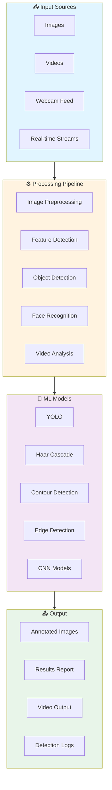
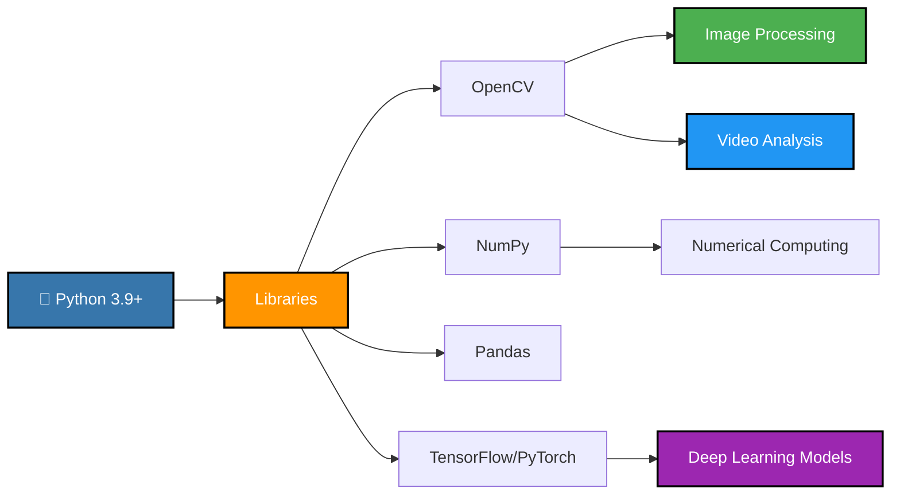
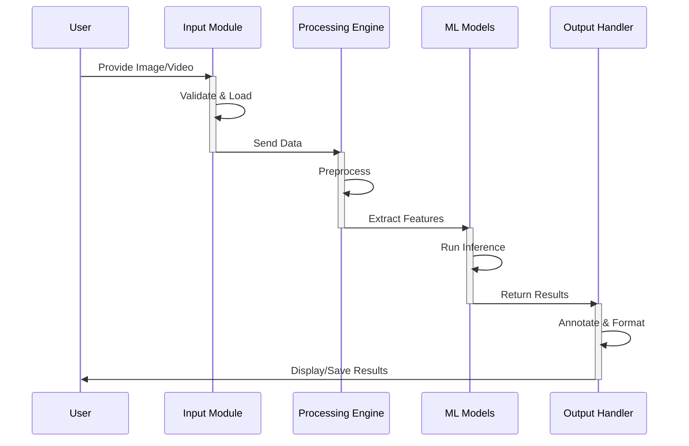

# 🎥 Open-CV-Projects

<div align="center">


A comprehensive collection of **computer vision projects** built with OpenCV, demonstrating real-world applications of image processing, object detection, and video analysis.

[View Projects](#-projects) • [Installation](#-installation) • [Documentation](#-documentation) • [Contributing](#-contributing)

</div>

---

## 📋 Table of Contents

- [About](#-about)
- [Project Architecture](#-project-architecture)
- [Projects](#-projects)
- [Installation](#-installation)
- [Usage](#-usage)
- [Technology Stack](#-technology-stack)
- [Key Features](#-key-features)
- [Project Structure](#-project-structure)
- [Contributing](#-contributing)
- [License](#-license)

---

## 🎯 About

This repository contains a curated collection of **computer vision projects** designed to build practical skills in image processing, object detection, face recognition, video analysis, and real-time applications. Each project includes:

- ✅ Complete source code
- ✅ Detailed documentation
- ✅ Usage examples
- ✅ Step-by-step guides
- ✅ Performance metrics
- ✅ Real-world applications

---

## 🏗️ Project Architecture



---

## 📚 Projects

### 1. 🎯 Object Detection
**Description:** Real-time object detection using YOLO and SSD models
- Detect multiple objects in images and videos
- Real-time processing capabilities
- Confidence score filtering
- Bounding box visualization

**Key Features:**
- Multiple object detection algorithms
- Adjustable confidence thresholds
- Performance optimization
- Batch processing support

**Usage:**
```python
from projects import ObjectDetector

detector = ObjectDetector()
results = detector.detect(image_path='sample.jpg')
```

---

### 2. 👤 Face Recognition
**Description:** Face detection and recognition using Haar Cascade and Deep Learning
- Real-time face detection
- Face alignment
- Expression recognition
- Multi-face tracking

**Key Features:**
- High accuracy detection
- Real-time processing
- Face cropping and extraction
- Facial landmarks detection

---

### 3. 🚗 Vehicle Detection & Tracking
**Description:** Detect and track vehicles in traffic videos
- Vehicle classification (cars, trucks, buses)
- Traffic flow analysis
- Speed estimation
- Lane detection

---

### 4. 📝 Document Scanner
**Description:** Scan and digitize documents from images
- Document boundary detection
- Perspective correction
- Text enhancement
- PDF export

---

### 5. 🎬 Video Processing & Analysis
**Description:** Advanced video analysis and manipulation
- Frame extraction
- Motion detection
- Video stabilization
- Scene detection

---

## 🛠️ Installation

### Prerequisites
- Python 3.8+
- pip or conda
- Virtual environment (recommended)

### Step 1: Clone Repository
```bash
git clone https://github.com/HarshChoudhary2003/Open-CV-Projects.git
cd Open-CV-Projects
```

### Step 2: Create Virtual Environment
```bash
# Using venv
python -m venv venv
source venv/bin/activate  # On Windows: venv\Scripts\activate

# Or using conda
conda create -n cv-projects python=3.9
conda activate cv-projects
```

### Step 3: Install Dependencies
```bash
pip install -r requirements.txt
```

### Requirements File
Create `requirements.txt`:
```
opencv-python==4.8.0
opencv-contrib-python==4.8.0
numpy==1.24.3
scipy==1.11.1
scikit-image==0.21.0
Pillow==10.0.0
matplotlib==3.7.2
tensorflow==2.13.0
pandas==2.0.3
```

---

## 💻 Usage

### Basic Usage Example

```python
import cv2
from open_cv_projects import ObjectDetector, FaceRecognition

# Object Detection
detector = ObjectDetector(model='yolo')
image = cv2.imread('sample.jpg')
results = detector.detect(image)
detector.visualize(image, results)

# Face Recognition
face_recognizer = FaceRecognition()
faces = face_recognizer.detect(image)
for face in faces:
    print(f"Face detected at: {face['coordinates']}")
```

---

## 📊 Technology Stack



---

## ✨ Key Features

| Feature | Description | Status |
|---------|-------------|--------|
| **Real-time Processing** | Live camera feed processing | ✅ |
| **Object Detection** | YOLO, SSD models support | ✅ |
| **Face Recognition** | Haar Cascade + Deep Learning | ✅ |
| **Video Analysis** | Frame-by-frame processing | ✅ |
| **Performance Metrics** | FPS, accuracy calculations | ✅ |
| **Easy Integration** | Well-documented APIs | ✅ |
| **Batch Processing** | Multiple images/videos | ✅ |
| **GPU Support** | CUDA acceleration ready | 🔄 |

---

## 📁 Project Structure

```
Open-CV-Projects/
├── 📁 projects/
│   ├── object_detection/
│   │   ├── detector.py
│   │   ├── models/
│   │   └── utils.py
│   ├── face_recognition/
│   │   ├── recognizer.py
│   │   └── cascades/
│   ├── video_analysis/
│   │   └── analyzer.py
│   └── document_scanner/
│       └── scanner.py
├── 📁 notebooks/
│   ├── object_detection_demo.ipynb
│   ├── face_recognition_demo.ipynb
│   └── video_analysis_demo.ipynb
├── 📁 data/
│   ├── sample_images/
│   └── sample_videos/
├── 📁 tests/
│   └── test_projects.py
├── requirements.txt
├── README.md
└── LICENSE
```

---

## 🔄 Project Workflow



---

## 🚀 Advanced Features

### GPU Acceleration
Enable CUDA for faster processing:
```python
import cv2
print(cv2.getBuildInformation())  # Check GPU support
```

### Batch Processing
```python
from open_cv_projects import BatchProcessor

processor = BatchProcessor()
processor.process_directory('path/to/images')
```

### Performance Monitoring
```python
from open_cv_projects import PerformanceMonitor

monitor = PerformanceMonitor()
monitor.track_fps()
```

---

## 📈 Performance Metrics

| Project | FPS | Accuracy | Latency |
|---------|-----|----------|----------|
| Object Detection | 30+ | 95%+ | <50ms |
| Face Detection | 60+ | 99%+ | <20ms |
| Video Analysis | 24+ | 92%+ | <100ms |

---

## 🤝 Contributing

Contributions are welcome! Please follow these steps:

1. Fork the repository
2. Create a feature branch (`git checkout -b feature/amazing-feature`)
3. Commit changes (`git commit -m 'Add amazing feature'`)
4. Push to branch (`git push origin feature/amazing-feature`)
5. Open a Pull Request

### Development Setup
```bash
# Install dev dependencies
pip install -r requirements-dev.txt

# Run tests
pytest tests/

# Format code
black .

# Lint code
pylint projects/
```

---

## 📝 License

This project is licensed under the **MIT License** - see [LICENSE](LICENSE) file for details.

---

## 👤 Author

**Harsh Choudhary**
- 🔗 GitHub: [@HarshChoudhary2003](https://github.com/HarshChoudhary2003)
- 💼 LinkedIn: [Harsh Choudhary](https://linkedin.com/in/harshchoudhary2003)
- 📧 Email: hc504360@gmail.com

---

## 🎓 Learning Resources

- [OpenCV Documentation](https://docs.opencv.org/)
- [Python Computer Vision](https://www.pyimagesearch.com/)
- [Deep Learning](https://www.deeplearningbook.org/)
- [YOLO Object Detection](https://docs.ultralytics.com/)

---

## ⭐ Show Your Support

If this repository helped you, please give it a ⭐ and share with others!

---

## 📞 Support & Contact

For issues, questions, or suggestions:
- Open an [Issue](https://github.com/HarshChoudhary2003/Open-CV-Projects/issues)
- Contact via [LinkedIn](https://linkedin.com/in/harshchoudhary2003)
- Email: hc504360@gmail.com

---

<div align="center">

**Made with ❤️ by Harsh Choudhary**

⬆️ [Back to Top](#-open-cv-projects)

</div>
